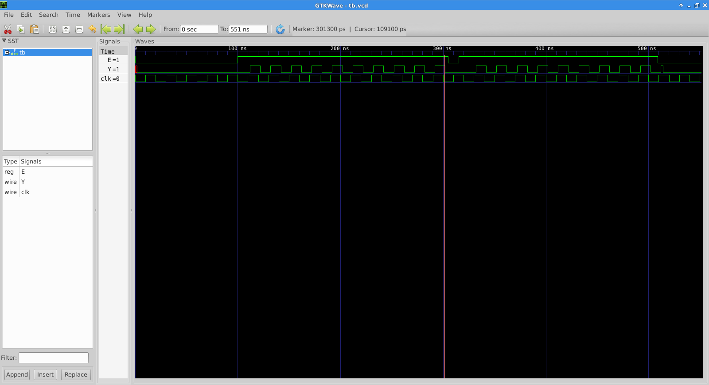

# edn_2015_01_12
A Verilog implementation of the gating circuit described in EDN : http://www.edn.com/design/systems-design/4438302/Circuit-gates-pulse-train-without-truncating

Unfortunatly, the proposed circuit does not seems to work when gate delay is taken in account

